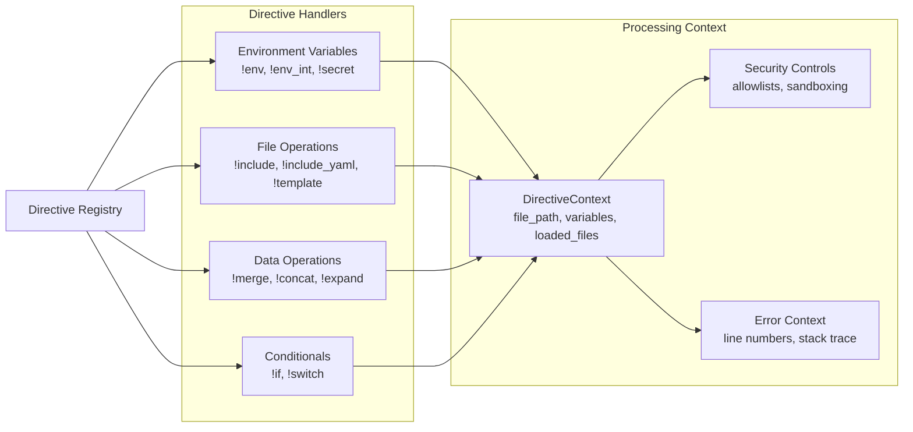
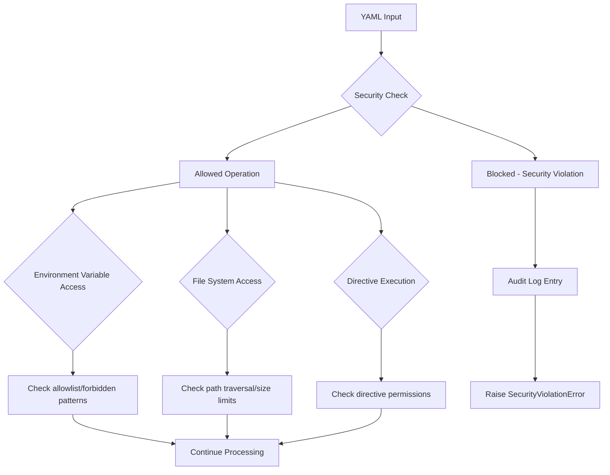
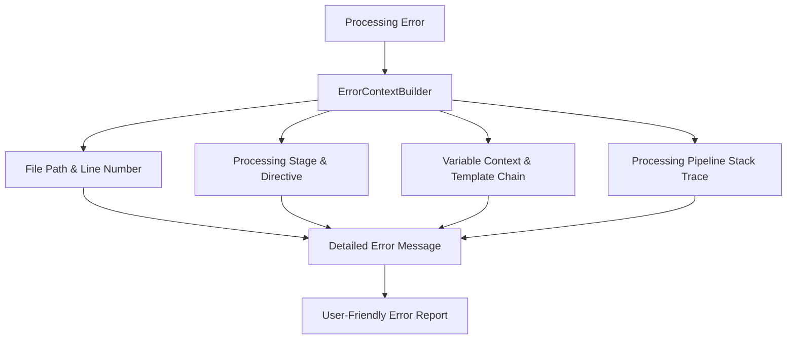
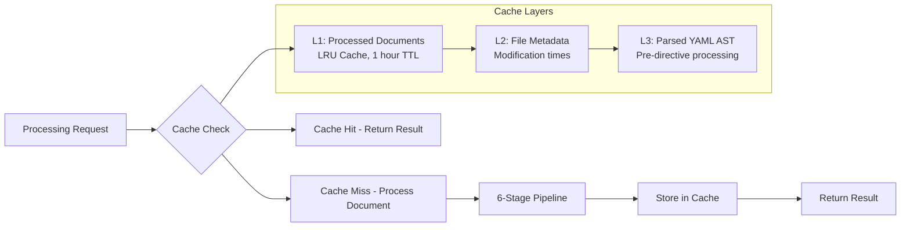

# SmartYAML Architecture

## Overview

SmartYAML is a Python library that extends standard YAML parsing with a 6-stage processing pipeline. It adds custom directives (like `!env`, `!include`, `!template`) for dynamic content generation, template inheritance, variable substitution, and security controls.

## Core Architecture

SmartYAML uses a modular pipeline architecture where YAML documents pass through sequential processing stages. Each stage is responsible for a specific transformation, ensuring predictable execution order and easy debugging.

### System Components

```mermaid
graph TB
    subgraph "SmartYAML Library"
        API[Public API<br/>load(), loads(), load_file()]
        Config[Configuration System<br/>Security, Paths, Performance]
        Pipeline[Processing Pipeline<br/>6-Stage Sequential Processing]
        Directives[Directive System<br/>Custom Tag Handlers]
        Errors[Error System<br/>Context-Aware Error Handling]
        Utils[Utilities<br/>Merge, Security, Validation]
        Cache[Caching Layer<br/>LRU Cache with TTL]
    end
    
    subgraph "External Dependencies"
        PyYAML[PyYAML Library<br/>Core YAML Parsing]
        JSONSchema[JSON Schema<br/>Validation - Optional]
    end
    
    subgraph "External Systems"
        FS[File System<br/>YAML Files, Templates]
        ENV[Environment Variables<br/>Runtime Configuration]
    end
    
    API --> Config
    API --> Pipeline
    Pipeline --> Directives
    Pipeline --> Errors
    Pipeline --> Utils
    Pipeline --> Cache
    Pipeline --> PyYAML
    Pipeline --> JSONSchema
    Pipeline --> FS
    Pipeline --> ENV
```

### Current Module Structure

```
smartyaml/
├── __init__.py              # Main API (load, loads, load_file)
├── cache.py                 # LRU caching with TTL
├── debug.py                 # Processing debugger
├── exceptions.py            # Exception hierarchy
├── config/                  # Configuration system
│   ├── builder.py           # Fluent configuration builder
│   ├── core.py              # Base configuration classes
│   ├── main.py              # SmartYAMLConfig main class
│   ├── performance.py       # Performance settings
│   └── security.py          # Security configuration
├── directives/              # Directive system
│   ├── base.py              # Base directive classes
│   ├── registry.py          # Directive registration
│   └── handlers/            # Built-in directive handlers
│       ├── conditional.py   # !if, !switch directives
│       ├── data.py          # !merge, !concat, !expand
│       ├── env.py           # !env, !secret directives
│       └── file.py          # !include, !template directives
├── errors/                  # Error handling system
│   ├── context.py           # ErrorContext, ErrorContextBuilder
│   └── helpers.py           # Error validation helpers
├── pipeline/                # Processing pipeline
│   ├── directives.py        # Stage 4: Directive processing
│   ├── metadata.py          # Stage 2: Metadata extraction
│   ├── parser.py            # Stage 1: YAML parsing
│   ├── processor.py         # Main pipeline orchestrator
│   ├── templates.py         # Stage 3: Template processing
│   ├── validator.py         # Stage 6: Schema validation
│   └── variables.py         # Stage 5: Variable expansion
└── utils/                   # Utility modules
    ├── merge.py             # Deep merge strategies
    ├── security.py          # Security validation utilities
    └── message_templates.py # Error message templates
```

## The Processing Pipeline

SmartYAML processes YAML documents through 6 sequential stages:

### Pipeline Flow Diagram

```mermaid
flowchart TD
    Input[YAML Input] --> Stage1[Stage 1: YAML Parsing]
    Stage1 --> Stage2[Stage 2: Metadata Extraction]
    Stage2 --> Stage3[Stage 3: Template Processing]
    Stage3 --> Stage4[Stage 4: Directive Processing]
    Stage4 --> Stage5[Stage 5: Variable Expansion]
    Stage5 --> Stage6[Stage 6: Schema Validation]
    Stage6 --> Output[Processed Output]
    
    subgraph "Stage Details"
        Stage1 --> S1Detail[Parse YAML with custom constructors<br/>Handle SmartYAML directive tags]
        Stage2 --> S2Detail[Extract __vars, __template, __schema<br/>Separate metadata from content]
        Stage3 --> S3Detail[Process template inheritance<br/>Apply template overlays]
        Stage4 --> S4Detail[Execute custom directives<br/>!env, !include, !merge, etc.]
        Stage5 --> S5Detail[Expand {{variable}} syntax<br/>Substitute values with Jinja-like processing]
        Stage6 --> S6Detail[Validate against JSON Schema<br/>Ensure output correctness]
    end
```

### Stage-by-Stage Processing

**Stage 1: YAML Parsing** (`pipeline/parser.py`)
- Uses PyYAML with custom `SmartYAMLLoader`
- Converts directive tags (`!env`, `!include`) into structured data
- Preserves line numbers for error reporting
- Checks `__version` compatibility

**Stage 2: Metadata Extraction** (`pipeline/metadata.py`)
- Extracts metadata fields (`__vars`, `__template`, `__schema`)
- Separates configuration metadata from actual data content
- Builds variable context for later processing
- Validates metadata structure

**Stage 3: Template Processing** (`pipeline/templates.py`)
- Processes `__template` inheritance chains
- Loads and merges parent templates
- Applies template overlays and variable inheritance
- Handles recursive template dependencies

**Stage 4: Directive Processing** (`pipeline/directives.py`)
- Executes custom directive handlers recursively
- Processes directives depth-first through the document tree
- Handles directive-specific logic (`!env`, `!include`, `!merge`, etc.)
- Maintains processing context across directive calls

**Stage 5: Variable Expansion** (`pipeline/variables.py`)
- Expands `{{variable_name}}` syntax throughout the document
- Uses Jinja-like variable substitution with security controls
- Applies variable precedence rules (local → template → global)
- Handles nested variable references

**Stage 6: Schema Validation** (`pipeline/validator.py`)
- Validates final output against JSON Schema (if provided)
- Supports Draft 2020-12 with backward compatibility
- Provides detailed validation error messages
- Optional stage (only runs if `__schema` is specified)

### Directive System



### Built-in Directives

**Environment Variable Access:**
- `!env [var_name, default]` - Get environment variable as string
- `!env_int [var_name, default]` - Get environment variable as integer
- `!env_float [var_name, default]` - Get environment variable as float
- `!env_bool [var_name, default]` - Get environment variable as boolean
- `!secret [var_name]` - Get sensitive environment variable with audit logging

**File Operations:**
- `!include 'path'` - Include and process another YAML file with SmartYAML directives
- `!include_yaml 'path'` - Include raw YAML content without directive processing
- `!template 'name'` - Load template file content
- `!include_if [condition, 'path']` - Conditional file inclusion
- `!template_if [condition, 'name']` - Conditional template loading

**Data Manipulation:**
- `!merge [obj1, obj2, ...]` - Deep merge multiple objects
- `!concat [arr1, arr2, ...]` - Concatenate multiple arrays
- `!expand {key: value}` - Expand key-value pairs into the parent object

**Conditional Logic:**
- `!if [condition, true_value, false_value]` - Conditional value selection
- `!switch [value, {case1: result1, case2: result2}]` - Switch statement logic

## Processing Context

Each processing stage operates with a shared context object that maintains:

- **File Information**: Current file path, base path, loaded files (cycle detection)
- **Variables**: Variable definitions from `__vars` and template inheritance
- **Configuration**: Security settings, path restrictions, feature flags
- **Error Context**: Line numbers, processing stage, directive stack trace
- **Recursion Control**: Depth tracking, cycle detection, resource limits

## Security Architecture

### Security Controls Flow



### Security Features

**Sandboxed Execution:**
- Default deny-all environment with explicit allowlists
- Environment variable access control with forbidden patterns
- File system path traversal prevention
- File size limits (10MB default, configurable)

**Access Controls:**
- `allowed_env_vars`: Regex patterns for permitted environment variables
- `forbidden_env_vars`: Regex patterns for blocked environment variables
- `base_path_restrictions`: Limit file access to specific directories
- `max_file_size`: Prevent processing of oversized files

**Audit Logging:**
- Security violations logged with full context
- Environment variable access attempts
- File system access attempts
- Template inheritance chains

## Error Handling

### Error Context System



### Exception Hierarchy

```
SmartYAMLError (base)
├── DirectiveSyntaxError          # Invalid directive syntax
├── SecurityViolationError        # Security policy violation
├── FileNotFoundError             # Missing included file
├── FileSizeExceededError         # File too large
├── SchemaValidationError         # JSON Schema validation failure
├── VersionMismatchError          # Incompatible SmartYAML version
├── RecursionError                # Template inheritance cycle
└── TemplateError                 # Template processing failure
```

## Performance Architecture

### Caching Strategy



**Cache Features:**
- **L1 Cache**: In-memory LRU cache for fully processed documents
- **L2 Cache**: File system metadata cache for modification time tracking
- **L3 Cache**: Parsed YAML AST cache before directive processing
- **Cache Keys**: SHA-256 hash of file path + modification time + configuration
- **Invalidation**: Automatic invalidation on file changes or configuration updates

### Performance Characteristics

**Current Performance Metrics:**
- Simple YAML parsing: <10ms p95 latency
- Complex template processing: <100ms p95 latency  
- Memory usage: ~10MB per 1MB processed document
- Cache hit ratio: >90% for repeated file processing
- Throughput: 1000+ simple documents/second

## API Usage

### Basic Usage

```python
import smartyaml

# Load a YAML file with SmartYAML processing
result = smartyaml.load('config.yaml')

# Load from string
yaml_string = """
database:
  host: !env [DB_HOST, localhost]
  port: !env_int [DB_PORT, 5432]
"""
result = smartyaml.loads(yaml_string)

# Load with configuration
from smartyaml.config import SmartYAMLConfigBuilder

config = (SmartYAMLConfigBuilder()
    .with_security_preset('strict')
    .with_template_dirs(['/templates'])
    .build())

result = smartyaml.load('config.yaml', config=config)
```

### Example Processing Flow

**Input YAML:**
```yaml
__template: base.yaml
__vars:
  app_name: "MyApp"
  
database:
  host: !env [DB_HOST, localhost]
  port: !env_int [DB_PORT, 5432]
  name: "{{app_name}}_db"

features: !concat [
  ['basic', 'auth'],
  !if [!env [PREMIUM_FEATURES, false], ['premium'], []]
]
```

**Processing Steps:**
1. **Parse**: Convert YAML with directive tags to structured data
2. **Metadata**: Extract `__template: base.yaml` and `__vars`
3. **Templates**: Load and merge `base.yaml` template
4. **Directives**: Execute `!env`, `!env_int`, `!concat`, `!if` directives
5. **Variables**: Expand `{{app_name}}` to "MyApp"
6. **Validate**: Check against schema (if `__schema` provided)

**Final Output:**
```python
{
    'database': {
        'host': 'localhost',  # from environment or default
        'port': 5432,         # from environment or default
        'name': 'MyApp_db'    # variable expansion
    },
    'features': ['basic', 'auth']  # conditional premium features
}
```

This architecture provides a powerful, secure, and performant foundation for advanced YAML configuration processing with extensive customization capabilities.